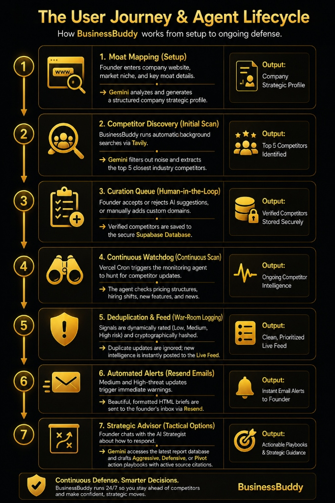

# BusinessBuddy 📡

**Continuous, proactive competitor intelligence for founders and operators.**

BusinessBuddy moves competitive research from a manual chore to a push-based autonomous workflow. It maps your company's moat, discovers real competitors, continuously scans the market, and delivers high-impact war-room updates, strategic email briefs, and real-time response advice.

[GitHub Repository](https://github.com/Danish2op/BusinessBuddy) · [Live Demo](https://businessbuddy.danis.live)

---

## 💡 The Core Concept

Most founders only research competitors when they remember to, or when it's too late. BusinessBuddy is built to watch the battlefield 24/7 and warn you before you even think to ask.

### The User Journey & Agent Lifecycle



---

## ✨ Features Showcase

### 🔍 Interactive War-Room & Live Feed
*   **Real-time Intelligence Timeline:** A visual command center showcasing parsed, categorized competitor updates (Pricing, Product, Hiring, and News).
*   **Dynamic Risk Badges:** Every incoming alert is classified with a visual risk level (Low, Med, High) based on its strategic impact on your company's unique moat.
*   **Action Triggers:** Instantly triggers manual actions, such as emailing specific intelligence logs to your team with a single click.

### 🧠 AI-Powered Strategic Advisor
*   **Context-Aware Strategy Chat:** Engage with a strategy advisor that has full contextual access to your company profile, core moat, and all crawled competitor intelligence reports.
*   **Structured Battle Playbooks:** For every strategic query, the advisor structures responses into three actionable playbooks:
    *   **Aggressive:** Offensive counter-measures.
    *   **Defensive:** Moat fortification strategies.
    *   **Pivot:** Product or marketing realignment suggestions.
*   **Source Citation Integration:** Every advice block links directly back to the specific source URLs and crawled reports, preventing AI hallucinations.

### ✉️ Automated Alerts & Emailer
*   **Continuous Background Scans:** Running via Vercel Cron, the agent hunts for changes, pricing edits, and hiring announcements.
*   **High-Threat Warnings:** Automatically generates and delivers beautifully formatted HTML emails via Resend whenever a high or medium-risk shift is discovered.
*   **Ad-Hoc Briefs:** Request on-demand email digests directly from your feed to share competitor updates instantly.

### ➕ Instant Competitor Onboarding & Curation
*   **AI-Assisted Discovery:** During onboarding, Tavily scans the web and Gemini filters out the noise to suggest the top 5 competitors in your industry.
*   **Manual Competitor Insertion:** Add any competitor instantly by domain or LinkedIn URL. BusinessBuddy will automatically fetch the website, parse metadata, and generate a strategic knowledge block for it.
*   **Human-in-the-Loop Control:** Founders have final curation control. Accept or reject AI-generated suggestions before monitoring starts, keeping the intelligence clean.

### 🛡️ Smart Hashing & Deduplication
*   **Signature-Based Deduplication:** Generates stable cryptographic hashes of incoming signals. If a news article or pricing change was already analyzed, the agent ignores it, saving LLM tokens and preventing alert fatigue.
*   **Security & Isolation:** Multi-tenant database layout secured by Supabase Row-Level Security (RLS) ensures your company profile and competitor data are fully isolated.

---

## 🛠️ Tech Stack

| Area | Technologies |
| :--- | :--- |
| **Frontend** | Next.js 14 (App Router), React, Tailwind CSS, Lucide |
| **Database & Auth** | Supabase Postgres (RLS-backed), Supabase Auth |
| **AI Integration** | Google Gemini API |
| **Web Research** | Tavily Search API (with fallback query strategies) |
| **Alert Delivery** | Resend API (Transactional HTML Briefs) |
| **Scheduling** | Vercel Cron Jobs |
| **Testing Suite** | Vitest, TypeScript, Testing Library |

---

## ⚡ Quick Start

### 1. Setup Environment
Copy the example configuration:
```bash
cp .env.example .env.local
```
Configure your keys for Supabase, Gemini, Tavily, and Resend in `.env.local`.

### 2. Install and Run
```bash
npm install
npm run dev
```

### 3. Run Verification Tests
```bash
# Run unit and integration tests
npm test

# Run type checks
npm run lint
```
